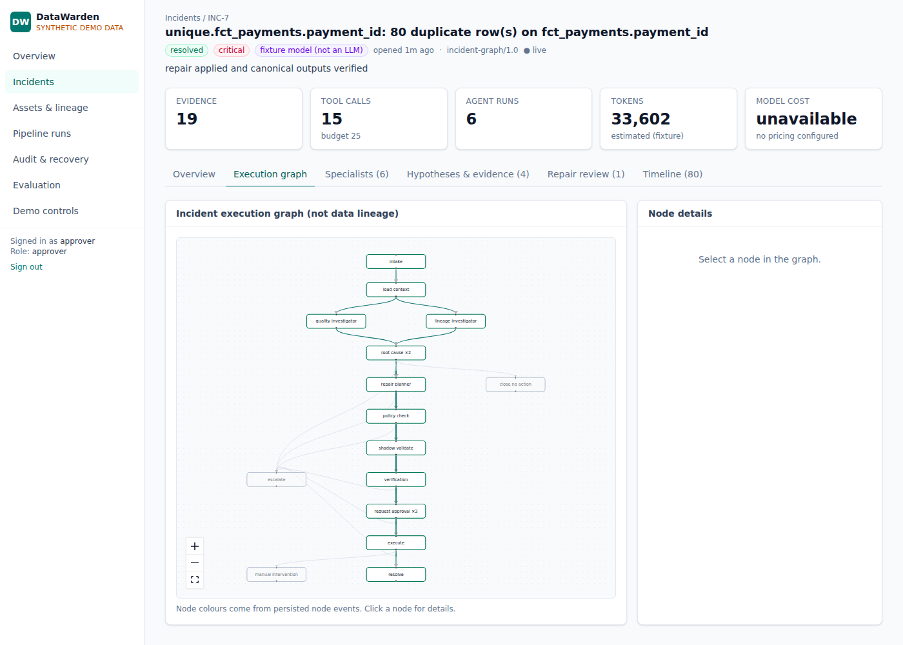
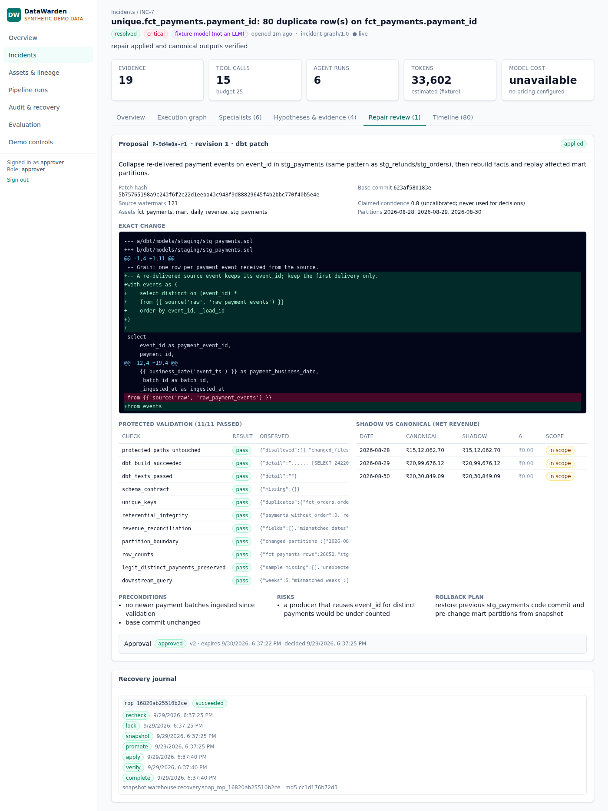

# DataWarden

Autonomous data-quality investigation and **verified** pipeline recovery — a portfolio-grade
prototype on synthetic data.

DataWarden watches a retail revenue pipeline (57k synthetic events → append-only raw → dbt →
daily revenue mart). When a protected check fails, five specialist agents investigate with real
tools, a planner proposes the smallest safe repair, the repair is validated in an isolated shadow
schema against checks the agents cannot edit, an authorized human approves it, and a journaled
executor applies it, verifies the result, and rolls back if anything is off.

> **AI proposes; deterministic systems validate; authorized humans approve.**

Status of every feature, with evidence: [`docs/BUILD_STATUS.md`](docs/BUILD_STATUS.md).

| Incident workspace (live execution graph) | Repair review (diff, protected validation, journal) |
| --- | --- |
|  |  |

## What is in the box

| Area | Implementation |
| --- | --- |
| Data | Deterministic generator (seeded), immutable checksummed batches, versioned contracts, append-only raw, dbt staging/facts/incremental mart, independent reconciliation oracle |
| Detection | 21 protected checks (freshness, uniqueness, required fields, referential integrity, valid states, contracts, reconciliation, row-count anomaly) + dbt tests + pipeline task status |
| Faults | 9 reproducible scenarios ([catalog](docs/FAULT_CATALOG.md)) incl. a faulty AI planner and prompt injection |
| Agents | Quality, Lineage & Impact, Root Cause, Repair Planner, Verification Analyst on a LangGraph controller with parallel fan-out, bounded loops, budgets, Postgres checkpoints, and an approval interrupt |
| Recovery | Proposal policy → shadow schema → 11 protected validation checks → hash-bound approval → executor saga (locks, snapshot, versioned promotion, bounded replay, verification, verified rollback) |
| Platform | FastAPI (session auth, roles, CSRF, signed idempotent event ingestion, SSE), Postgres job queue + outbox, worker, append-only audit, OpenTelemetry hooks, JSON logs |
| UI | React + TypeScript + Vite + Tailwind + React Flow: overview, assets & lineage, incident workspace (live execution graph, evidence, hypotheses, repair review with diff/validation/shadow comparison), runs & logs, audit & recovery journal, evaluation, demo panel |
| Integrations | Airflow 3 (full profile, DAG + failure callback + REST adapter), optional GitHub adapter, OpenAI-compatible / Azure OpenAI model adapters, read-only MCP server, optional webhooks |

## Quickstart (Docker Compose)

Requirements: Docker with Compose, `make`, Python 3.11 (for the `.env` generator).

```bash
make setup-env        # writes .env with generated secrets (never committed)
make up               # core profile: databases, migrations, API + dashboard, worker
make seed             # synthetic data, full pipeline build, catalog, demo accounts
open http://localhost:8000
```

Demo passwords are generated into `artifacts/demo_credentials.json` inside the `artifacts`
volume: `docker compose -f infra/docker-compose.yml exec worker cat /artifacts/demo_credentials.json`.

Profiles: `make up PROFILE=full` adds Airflow (http://localhost:8080, user `datawarden`, password
`DW_AIRFLOW_PASSWORD` from `.env`); `PROFILE=observability` adds an OpenTelemetry collector.

## Quickstart (host mode, for development)

Requirements: PostgreSQL 16 on `localhost:5432` with a superuser, `uv`, Node 22.

```bash
python3 scripts/gen_env.py                 # then set DW_PG_ADMIN_PASSWORD to your superuser password
uv sync && (cd apps/web && npm ci && npm run build)
uv run dw setup-db && uv run alembic upgrade head
uv run dw seed && uv run dw app-seed
make api      # terminal 1: http://localhost:8000 (serves the built dashboard)
make worker   # terminal 2
make web      # optional: Vite dev server on :5173 with API proxy
```

## Commands

| Command | What it does |
| --- | --- |
| `make setup` | `.env` + Python and web dependencies |
| `make up` / `make down` | start / stop the Compose stack (`PROFILE=core|full|observability`) |
| `make seed` | regenerate synthetic sources, rebuild warehouse, sync catalog, create demo users |
| `make pipeline` | one pipeline run; failing checks are sent to the API as signed events |
| `make fault SCENARIO=duplicate_payments` / `make fault-list` / `make reset` | synthetic fault injection and scoped reset |
| `make demo` | scripted demo: faulty proposal rejected, then a verified recovery |
| `make test` | all Python tests (unit, API, integration, 16 end-to-end scenarios) |
| `make e2e` | Playwright journey against a running stack |
| `make eval` | benchmark seeds × scenarios × {detection-only, single-agent, multi-agent} → `docs/EVALUATION.md` |
| `make lint` | ruff + TypeScript |
| `uv run dw --help` | CLI: `setup-db`, `seed`, `pipeline`, `checks`, `fault`, `worker`, `eval`, `demo`, `mcp`, `airflow` |

## Model modes

- `DW_MODEL_PROVIDER=fixture` (default): deterministic rule-based model responses. Same graph,
  real tools, real dbt, real validation. **Not an LLM** — results do not measure LLM reasoning.
- `openai_compatible` or `azure_openai`: set `DW_MODEL_ENDPOINT`, `DW_MODEL_NAME`,
  `DW_MODEL_API_KEY` (and `DW_MODEL_API_VERSION` for Azure). Optional pricing variables enable cost
  estimates; without them cost shows "unavailable".

## Local `.env` fields you may need to fill

Generated automatically: database role passwords, HMAC signing secret, session secret, Airflow
password. Fill yourself only if used: `DW_PG_ADMIN_PASSWORD` (host mode: your superuser password),
`DW_MODEL_*` (live model), `DW_GITHUB_TOKEN` / `DW_GITHUB_REPO`, `DW_WEBHOOK_URL`,
`DW_LANGFUSE_HOST`, `DW_OTEL_EXPORTER_OTLP_ENDPOINT`.

## Documentation

- [Architecture](docs/ARCHITECTURE.md) — components, execution graph vs. data lineage diagrams
- [Agent and tool contracts](docs/AGENTS_AND_TOOLS.md)
- [Data model and API](docs/DATA_MODEL_AND_API.md)
- [Threat model and permission matrix](docs/THREAT_MODEL.md)
- [Runbooks: recovery, rollback, failed rollback](docs/RUNBOOKS.md)
- [Fault catalog](docs/FAULT_CATALOG.md) · [Evaluation report](docs/EVALUATION.md)
- [5-minute demo script](docs/DEMO_SCRIPT.md) · [Deployment (VM + Azure proposal)](docs/DEPLOYMENT.md)
- [Portfolio explanation and resume templates](docs/PORTFOLIO.md)
- [Assumptions](docs/ASSUMPTIONS.md) · [Build plan](docs/BUILD_PLAN.md) · [Original spec](docs/SPEC.md)

## Troubleshooting

| Symptom | Fix |
| --- | --- |
| `password for role … is empty` | run `python3 scripts/gen_env.py` |
| Host mode: `password authentication failed for user "postgres"` | set `DW_PG_ADMIN_PASSWORD` in `.env` to your PostgreSQL superuser password |
| Dashboard shows "Loading…" forever | API not running, or open the Vite dev server (`make web`) instead of `dist` |
| Incident stays `open` | the worker is not running (`make worker` / `docker compose … ps worker`) |
| `demo controls are disabled outside demo mode` | `DW_DEMO_MODE=true` is required for synthetic fault controls |
| Docker build fails with TLS errors behind a corporate proxy | `DW_BUILD_EXTRA_CA=/path/to/ca.pem make up` |
| Airflow shows as `disabled` | start with `make up PROFILE=full` (sets `DW_AIRFLOW_BASE_URL`) |

## Repository layout

```
src/datawarden/      Python: api, worker, agents, tools, contracts, pipeline, checks, oracle, recovery, evals
apps/web/            React dashboard + Playwright e2e
pipelines/dbt/       baseline dbt project (copied into a git-versioned runtime workspace)
pipelines/contracts/ versioned source contracts · pipelines/ingestion/ mappings · pipelines/airflow/ DAG
data/scenarios/      scenario assets (e.g. the v2 contract a producer publishes)
evals/results/       raw benchmark outputs
infra/               Dockerfiles, Compose, OTel config
migrations/          Alembic
tests/               pytest suites
docs/                documentation
```
