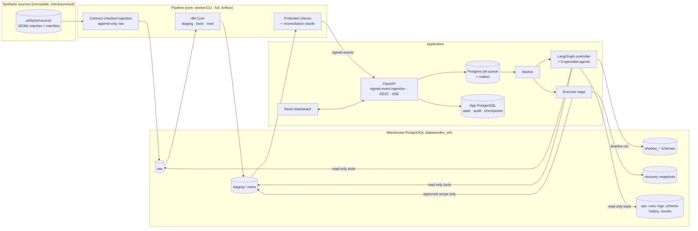
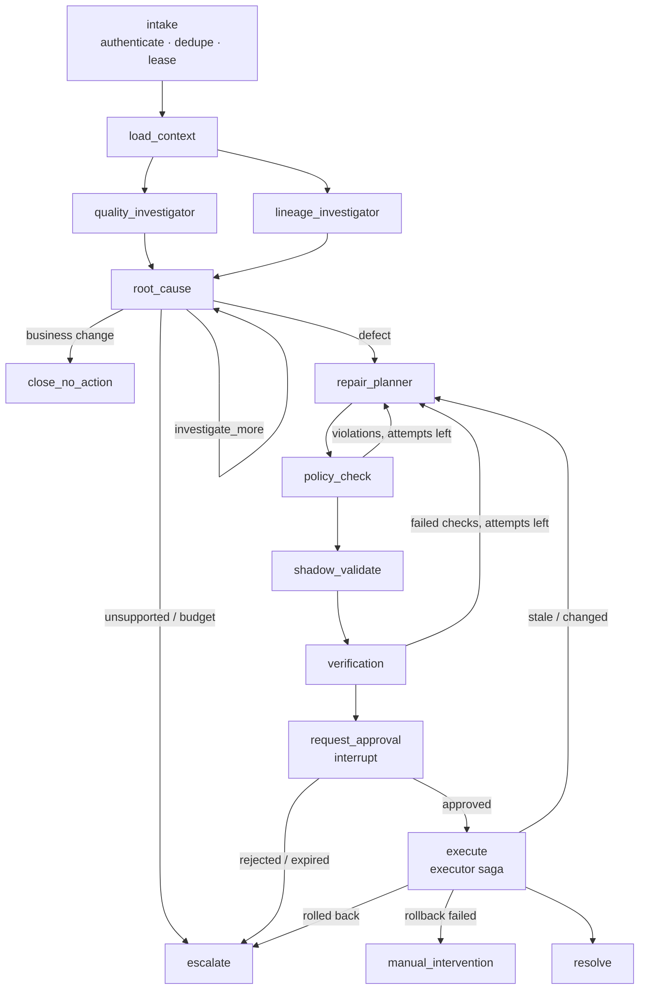
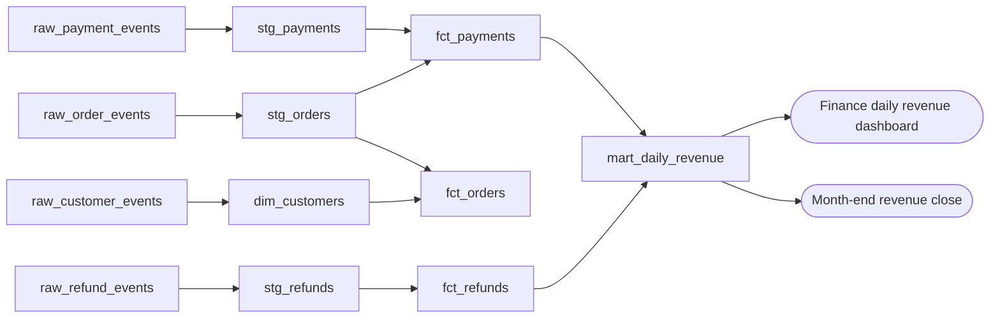

# Architecture

DataWarden detects data-quality incidents in a retail revenue pipeline, investigates them with
five specialist agents, proposes a constrained repair, validates it in an isolated shadow schema,
waits for an authorized human, applies it through a journaled executor, and verifies (or rolls
back) the canonical result.

**Core rule: AI proposes; deterministic systems validate; authorized humans approve.**

## Components

| Concern | Where | Notes |
| --- | --- | --- |
| Scheduling ordinary data runs | Airflow DAG (`pipelines/airflow`) or the worker's `pipeline_run` job | Both call the same `dw pipeline` implementation |
| Incident reasoning | LangGraph graph in the worker (`src/datawarden/agents`) | Never inside an HTTP request |
| Dispatch | Postgres job queue (`SKIP LOCKED`, leases, heartbeats) + transactional outbox | No second queue or workflow engine |
| Durable state | App PostgreSQL + LangGraph `PostgresSaver` checkpoints | Worker restarts resume from the last checkpoint |
| Canonical writes | Pipeline role (scheduled runs) and executor role (approved repairs) | Agents have neither credential |

## Two different graphs

### 1. Incident execution graph (LangGraph)

The control flow of one investigation. Nodes are controller steps and agents; edges are routing
decisions. Shown live in the incident workspace.

State (`IncidentState`, `agents/graph.py`) is typed and checkpointed after every node. Parallel
branches write only append-only reducer fields (`agent_findings`, `evidence_refs`, `hypotheses`,
`elapsed_time`, `token_usage`), so concurrent branches never overwrite each other.

### 2. Data lineage graph (dbt manifest)

The dependencies between data assets. Built from `dbt parse` output and shown on the Assets page.

## Agents

| Agent | Tools (allowlist) | Output |
| --- | --- | --- |
| Quality Investigator | quality results, asset metadata, read-only SQL, redacted samples, pipeline run | `AgentFinding` with symptoms, candidate hypotheses, evidence ids |
| Lineage & Impact Investigator | lineage neighbors (depth ≤ 3), asset metadata, business impact | impact map: assets, partitions, reports |
| Root Cause Investigator | pipeline run/logs, schema history, code changes, read-only SQL, samples | competing hypotheses, disconfirming evidence, conclusive root cause or next query |
| Repair Planner | propose_patch, code changes, schema history, asset metadata | `RepairProposalDraft` (patch, replay, mapping, no-action, escalation) |
| Verification Analyst | run_protected_validation (extra permitted checks) | `VerificationVerdict`; may reject, never overrule a failed check |

Each agent is a bounded loop: model decides → tool call (permission-checked, budgeted, persisted)
→ observation → … → schema-validated final output. See [`AGENTS_AND_TOOLS.md`](AGENTS_AND_TOOLS.md).

## Recovery path

1. **Policy** (`recovery/policy.py`): file allowlist, no DDL/DML, no row-hiding filters, no config
   changes, mappings only when a registered contract declares them, scope bounded by evidence.
2. **Shadow** (`recovery/shadow.py`): per-proposal schema owned by `dw_shadow` (no canonical
   privileges), detached code copy with the patch, pending batches ingested with patched mappings.
3. **Protected validation** (`recovery/validation.py`): 11 checks incl. independent oracle
   reconciliation, partition boundary, distinct legitimate payments preserved.
4. **Approval**: LangGraph `interrupt`; approval bound to the proposal hash, base commit and
   source watermark; 24 h expiry; optimistic concurrency.
5. **Executor saga** (`recovery/executor.py`): recheck → lock partitions → snapshot → promote code
   (versioned git commit) → bounded replay → verify → release; any failure → verified rollback;
   failed rollback → `manual_intervention`.

## Offline vs live models

`DW_MODEL_PROVIDER=fixture` uses a deterministic rule-based stand-in that sees exactly the same
observations a live model would. Everything else — tools, SQL, dbt, shadow, validation, approval,
execution — is real. `openai_compatible` and `azure_openai` use function calling with schema
validation and bounded retries. Every run is labelled with its mode.
